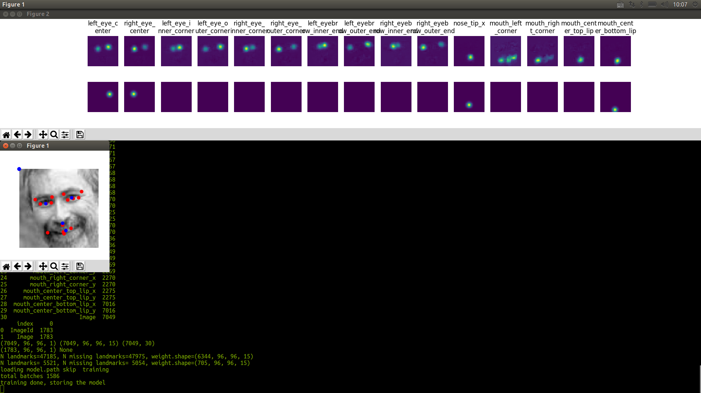

### Facial Keypoint Detection

My work on kaggle [facial keypoint challenge](https://www.kaggle.com/c/facial-keypoints-detection) 
this is the pytorch replication of the [blog post](https://www.kaggle.com/c/facial-keypoints-detection/discussion/57861)
Got the RMSE of 1.4 to 1.8 it's a top 20 score

to run the program, place all dataset file into the data folder or make a symboloc link
```
ln -s /path/to/your/dataset data
```
run the program
```
python fcn_reco.py
```

The final output looks like this


